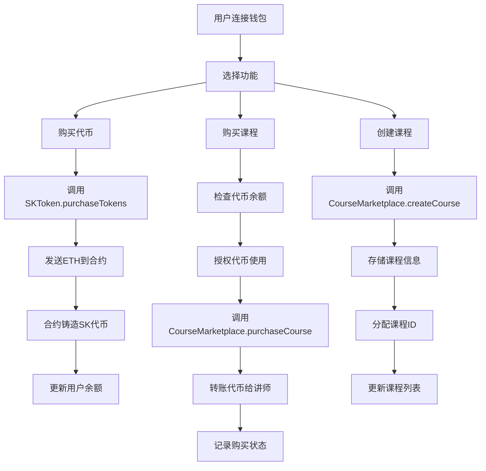

# 🎓 去中心化购课系统 (getCourses)

一个基于区块链技术的去中心化在线课程购买平台，使用以太坊智能合约和现代Web技术构建。

## 📋 项目概述

本项目实现了一个完整的去中心化课程交易平台，用户可以：
- 使用ETH兑换平台代币SK
- 用SK代币购买课程
- 创建和发布自己的课程
- 管理个人课程和收益

## 🛠 技术栈

### 区块链技术
- **Solidity**: 智能合约开发语言
- **Hardhat**: 以太坊开发环境
- **OpenZeppelin**: 安全的智能合约库
- **Ethers.js**: 以太坊JavaScript库

### 前端技术
- **Next.js**: React全栈框架
- **TypeScript**: 类型安全的JavaScript
- **Tailwind CSS**: 实用优先的CSS框架
- **RainbowKit**: Web3钱包连接组件
- **Wagmi**: React Hooks for Ethereum

## 🏗 项目架构

```
getCourses/
├── contracts/              # 智能合约
│   ├── SKToken.sol         # ERC20代币合约
│   └── CourseMarketplace.sol # 课程市场合约
├── scripts/                # 部署脚本
│   └── deploy.ts           # 合约部署脚本
├── test/                   # 测试文件
├── pages/                  # Next.js页面
│   ├── _app.tsx           # 应用入口
│   └── index.tsx          # 主页面
├── components/             # React组件
│   ├── CourseCard.tsx     # 课程卡片
│   ├── TokenPurchase.tsx  # 代币购买
│   ├── CreateCourse.tsx   # 创建课程
│   ├── MyCourses.tsx      # 我的课程
│   └── NetworkStatus.tsx  # 网络状态
├── lib/                   # 工具库
│   └── contracts.ts       # 合约配置
└── styles/                # 样式文件
```

## 🔧 核心功能实现

### 1. 智能合约架构

#### SKToken.sol - ERC20代币合约
```solidity
// 主要功能：
- 代币发行和管理
- ETH兑换SK代币 (1 ETH = 10,000 SK)
- 代币授权和转账
- 合约余额提取
```

#### CourseMarketplace.sol - 课程市场合约
```solidity
// 主要功能：
- 课程创建和管理
- 课程购买逻辑
- 5%平台手续费
- 购买状态查询
```

### 2. 前端架构

#### 状态管理
- 使用React Hooks管理组件状态
- Wagmi提供区块链状态管理
- 实时同步链上数据

#### 组件设计
- **模块化组件**: 每个功能独立封装
- **响应式设计**: 适配不同屏幕尺寸
- **错误处理**: 完善的错误提示和重试机制

### 3. 核心业务逻辑

#### 代币购买流程
```typescript
1. 用户输入想要购买的SK代币数量
2. 系统计算需要的ETH数量 (amount / 10000)
3. 调用SKToken.purchaseTokens()发送ETH
4. 合约自动铸造对应的SK代币给用户
5. 前端更新用户余额显示
```

#### 课程购买流程
```typescript
1. 用户选择要购买的课程
2. 检查用户SK代币余额是否足够
3. 授权CourseMarketplace合约使用代币
4. 调用purchaseCourse()完成购买
5. 合约转账代币并记录购买状态
6. 更新课程学生数量
```

#### 课程创建流程
```typescript
1. 用户填写课程信息（标题、描述、价格等）
2. 调用createCourse()创建课程
3. 合约存储课程信息并分配唯一ID
4. 前端更新课程列表
```

## 🚀 快速开始

### 环境要求
- Node.js >= 16.0.0
- npm 或 yarn
- MetaMask浏览器插件

### 安装依赖
```bash
npm install
```

### 启动本地区块链
```bash
npx hardhat node
```

### 部署智能合约
```bash
npx hardhat run scripts/deploy.ts --network localhost
```

### 启动前端应用
```bash
npm run dev
```

### 配置MetaMask

1. **添加本地网络**：
   - 网络名称: Hardhat Local
   - RPC URL: http://127.0.0.1:8545
   - 链ID: 31337
   - 货币符号: ETH

2. **导入测试账户**：
   ```
   私钥: 0xac0974bec39a17e36ba4a6b4d238ff944bacb478cbed5efcae784d7bf4f2ff80
   地址: 0xf39Fd6e51aad88F6F4ce6aB8827279cffFb92266
   余额: 10,000 ETH
   ```

## 📱 使用指南

### 1. 连接钱包
- 访问 http://localhost:3000
- 点击"Connect Wallet"连接MetaMask
- 确保网络切换到Hardhat Local

### 2. 购买SK代币
- 进入"购买代币"页面
- 输入想要购买的SK代币数量
- 确认交易并等待完成
- 查看余额更新

### 3. 浏览和购买课程
- 在"课程列表"查看可购买的课程
- 点击"购买课程"按钮
- 确认代币授权和购买交易
- 在"我的课程"查看已购买的课程

### 4. 创建课程
- 进入"创建课程"页面
- 填写课程信息
- 设置课程价格（SK代币）
- 提交创建交易

### 5. 管理课程
- 在"我的课程"查看创建的课程
- 查看课程收益统计
- 管理课程状态

## 🔍 代码运行逻辑

### 智能合约交互流程



### 前端状态管理

```typescript
// 主要状态管理逻辑
const [courses, setCourses] = useState<Course[]>([])
const [availableCourses, setAvailableCourses] = useState<Course[]>([])

// 监听合约数据变化
const { data: coursesData } = useReadContract({
  address: CONTRACTS.COURSE_MARKETPLACE,
  abi: COURSE_MARKETPLACE_ABI,
  functionName: 'getActiveCourses'
})

// 过滤可购买课程
useEffect(() => {
  if (coursesData && address) {
    const allCourses = coursesData as Course[]
    const purchasable = allCourses.filter(course => 
      course.instructor.toLowerCase() !== address.toLowerCase()
    )
    setAvailableCourses(purchasable)
  }
}, [coursesData, address])
```

## 🧪 测试

### 运行测试
```bash
npx hardhat test
```

### 测试覆盖
- 智能合约单元测试
- 代币购买功能测试
- 课程创建和购买测试
- 权限控制测试

## 📊 项目特色

### 安全性
- 使用OpenZeppelin安全合约库
- 完善的权限控制机制
- 防重入攻击保护
- 输入验证和错误处理

### 用户体验
- 直观的Web3界面设计
- 实时的交易状态反馈
- 智能的网络状态检测
- 响应式移动端适配

### 可扩展性
- 模块化的合约设计
- 可插拔的前端组件
- 标准化的API接口
- 支持多网络部署

## 🔮 未来规划

- [ ] 课程内容管理系统
- [ ] 视频流媒体集成
- [ ] 课程评价和评分
- [ ] NFT证书系统
- [ ] 多语言支持
- [ ] 移动端应用

## 📄 许可证

MIT License

## 🤝 贡献

欢迎提交Issue和Pull Request来改进项目！

## 📞 联系方式

如有问题或建议，请通过GitHub Issues联系。

---

**注意**: 本项目仅用于学习和演示目的，请勿在主网上使用未经审计的智能合约。
